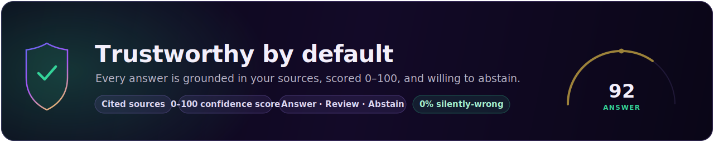
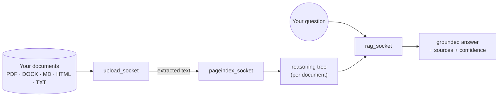

<div align="center">


**_No vectors. No chunking. No blind trust._**

[](https://github.com/1ssb/TuringTree)
[](#install-one-command)


<sub>Open source · <strong>vectorless, on-device RAG</strong></sub>

</div>

<br />


<br /><br />



---

# RagIndex — *Turing Tree*

**A vectorless, reasoning-based RAG that runs fully on your machine.** Drop in your
own documents (PDF, Word, Markdown, HTML, text); RagIndex builds a hierarchical
"table-of-contents" tree per document that a local LLM reasons over to answer your
questions — **no vector database, no chunk-embedding store, no API keys, no cloud.**
Every answer comes with **cited sources** and a **0–100 confidence score** so you
know when to trust it (and when the system abstains).

> **100% on-device.** The LLM and the embeddings are served locally by
> **[Ollama](https://ollama.com)** with small **Qwen** models. Nothing you upload
> or ask ever leaves your computer. One setup command installs and configures
> everything; one run command opens the app.

> **📊 The benchmark story — _same recall as a vector DB, but it knows when it's wrong._**
>
> In a controlled run (web-crawled Wikipedia science, 6 docs / 90 chunks, local Ollama),
> Turing Tree retrieved with the **same embeddings** as a classic vector database —
> **accuracy@5 = 1.00**, identical recall, **0.00** cross-contamination. The edge is a
> confidence layer a vector DB doesn't have: it **abstained on 100 % of off-topic
> questions** (the vector DB answered every one silently and wrongly), with a
> **+79.5 / 100** confidence separation between trustworthy and confused retrievals and
> **zero** false-abstentions on real questions. Re-indexing unchanged content is
> **198× faster** via the content-hash cache. → [Full method &amp; caveats](docs/benchmark.md)



### Highlights

- **Bring your own documents** — upload files or a whole folder; supported types:
  PDF, `.docx`, `.md`/`.markdown`, `.html`/`.htm`, `.txt`/`.text`.
- **Vectorless retrieval** — PageIndex turns each document into a tree the model
  navigates by *reasoning*, not nearest-neighbour vector lookup.
- **Confidence you can act on** — every answer gets a score + verdict
  (`ANSWER` / `REVIEW` / `ABSTAIN`) with explainable drivers; off-topic questions
  are flagged instead of answered wrongly.
- **Fast on CPU** — defaults to the small `qwen2.5:3b-instruct` for both indexing
  and answering, so one model stays resident and answers return quickly.
- **One app, one URL** — a single local process serves the web UI and the API and
  opens your browser. Reset the index or resume from a shared bundle anytime.

---

## Evaluate in ~5 minutes (for reviewers & judges)

Two commands set everything up and open the app — **no API keys, no cloud, no GPU.**

```bash
git clone https://github.com/1ssb/TuringTree.git RagIndex && cd RagIndex

# 1) Install everything (venv + deps + PageIndex model + Ollama + local models)
#    Windows ......  powershell -ExecutionPolicy Bypass -File scripts\setup.ps1
#    macOS / Linux .  bash scripts/setup.sh

# 2) Open the app (builds the UI once, then opens http://127.0.0.1:8765)
#    Windows ......  run.bat
#    macOS / Linux .  ./run.sh
```

Then, in the app, do these three things:

1. **Upload sample documents** — unzip [`samples/sample-docs.zip`](samples/sample-docs.zip)
   (one of every supported type) and drop the files in; wait for **Indexing** to finish.
2. **Ask an in-document question** (e.g. *"What is photosynthesis?"*) → you get a
   **grounded answer with cited sources** and a **0–100 confidence badge** (verdict `ANSWER`).
3. **Ask an off-topic question** (e.g. *"Who won the 2018 World Cup?"*) → instead of
   guessing, the app **abstains** (verdict `ABSTAIN`) and says it isn't covered.

**What makes this different from a normal RAG chatbot:**

- **Vectorless** — no vector database; each document becomes a *reasoning tree* the
  LLM navigates, so retrieval is by reasoning, not nearest-neighbour lookup.
- **It knows when it's wrong** — every answer carries a confidence score, and
  off-topic questions are *abstained* rather than answered incorrectly. In our
  [benchmark](#benchmarks-vs-a-vector-db-baseline): **0%** silently-wrong answers
  vs **100%** for a classic vector DB, at the **same retrieval accuracy**.
- **100% on-device** — local Qwen models via Ollama; nothing you upload or ask
  ever leaves the machine.

> **No Python on the machine?** A packaged, double-click **Windows app** (no Python
> needed) is described in [docs/desktop.md](docs/desktop.md). Hit a snag? See
> [Troubleshooting](#troubleshooting).

---

## Table of contents

- [Prerequisites](#prerequisites)
- [Install (one command)](#install-one-command)
- [Run the app (one command)](#run-the-app-one-command)
- [Using the app](#using-the-app)
- [Local models (Ollama + Qwen)](#local-models-ollama--qwen)
- [Configuration reference](#configuration-reference)
- [Reproducibility](#reproducibility)
- [Data, privacy & storage locations](#data-privacy--storage-locations)
- [Developer workflows](#developer-workflows)
- [HTTP API reference](#http-api-reference)
- [Troubleshooting](#troubleshooting)
- [The "socket" architecture](#the-socket-architecture)
- [Retrieval confidence scoring](#retrieval-confidence-scoring)
- [Benchmarks vs a vector-DB baseline](#benchmarks-vs-a-vector-db-baseline)
- [Findings, validation & test results](#findings-validation--test-results)
- [Bundled dataset & branch indexing](#bundled-dataset--branch-indexing)
- [Project layout](#project-layout)
- [Team](#team)
- [License & attribution](#license--attribution)

---

## Prerequisites

| Tool | Version | Notes |
| --- | --- | --- |
| **git** | any recent | clones the repo and the vendored PageIndex model |
| **Python** | **3.10+** (3.13 recommended) | runs the backend, sockets, and setup |
| **Node.js** | **18+** (with `npm`) | builds the web UI |
| **[Ollama](https://ollama.com)** | latest | local model runtime — **`setup` installs it for you** if missing |

You do **not** need any API keys or a GPU. Plan for roughly **3–4 GB of disk** for
the default local models (`qwen2.5:3b-instruct` ≈ 2 GB + `qwen3-embedding:0.6b` ≈
0.6 GB) and **8 GB+ RAM** for comfortable CPU inference.

---

## Install (one command)

```bash
# 1. Get the repository
git clone https://github.com/1ssb/TuringTree.git RagIndex
cd RagIndex

# 2. One command does everything (idempotent — safe to re-run):
#      - creates .venv and installs Python deps (root + backend)
#      - seeds .env from .env.example
#      - clones the PageIndex model and pins it to a known-good commit
#      - installs the frontend's Node deps (npm install)
#      - installs Ollama, starts it, and pulls the pinned local models
```

| Your OS | Command |
| --- | --- |
| **macOS / Linux** | `bash scripts/setup.sh` |
| **Windows (PowerShell)** | `powershell -ExecutionPolicy Bypass -File scripts\setup.ps1` |
| **Windows (cmd)** | `scripts\setup.bat` |
| **Any OS** (Python on PATH) | `python scripts/setup.py` |

Useful setup flags (any OS): `--skip-ollama` (don't install/start Ollama),
`--skip-models` (set up Ollama but skip the model pulls). Re-running setup never
re-downloads what already exists.

---

## Run the app (one command)

After setup, launch the desktop app. It builds the web UI the first time, then
serves the UI **and** the API from a single local process and opens your browser
at **http://127.0.0.1:8765**.

| Your OS | Command |
| --- | --- |
| **Windows** | `run.bat`  *(or double-click it in Explorer)* |
| **macOS / Linux** | `./run.sh` |
| **Any OS** | `python scripts/run.py` |

Flags are passed straight through to the launcher:

```bash
python scripts/run.py --no-browser     # serve without opening a browser (CI/servers)
python scripts/run.py --port 8765      # pin a specific port
```

Press **Ctrl+C** to stop. That's the whole story: **`setup` once, then `run`.**

---

## Using the app

1. **Upload** — on the *Index your documents* screen, click **Browse files** (pick
   one or many files) or **a whole folder**, or drag-and-drop. Supported types:
   PDF, `.docx`, `.md`/`.markdown`, `.html`/`.htm`, `.txt`/`.text`. Don't have
   anything handy? Use the bundled samples in [`samples/`](samples) — including
   [`samples/sample-docs.zip`](samples/sample-docs.zip) (one of every supported
   type) — unzip and drop them in.
2. **Indexing** — the app shows an explicit **Uploaded → Indexing** transition and
   a live progress bar while it builds a reasoning tree per document with the local
   model. This is the slow step on CPU; subsequent re-indexes of unchanged content
   are near-instant thanks to the content-hash cache.
3. **Chat** — ask questions in plain English. Each answer is **grounded in your
   documents**, cites the source documents it used, and carries a **confidence
   badge**. Click the badge to expand the drivers (**Focus**, **Cohesion**,
   **Consistency**) and the reasoning behind the verdict.
4. **Trust the verdict** — a high score means *answer*; a low score means the app
   **abstains** rather than guess. Off-topic questions (not covered by your
   documents) are flagged, not answered wrongly.
5. **Reset the index** — open **Settings** (bottom-left) → **Reset index** to clear
   every indexed document and start fresh (your chat history is kept). You're taken
   back to the upload screen to build a new index.
6. **Share / resume** — export a self-contained bundle of your conversation (and
   optionally the index) and **Resume from bundle** later or on another machine.

---

## Local models (Ollama + Qwen)

Everything is served by a local **[Ollama](https://ollama.com)** runtime, so the
project works completely offline once set up. The exact models are pinned in
[ollama-models.txt](ollama-models.txt) so every machine runs the same thing:

| Role | Model | Used by | Why |
| --- | --- | --- | --- |
| **Chat + index** (default) | `qwen2.5:3b-instruct` | answering **and** building the document tree | Small and fast on CPU, follows instructions well, and emits **clean JSON** (we avoid "thinking" models, whose extra tags break PageIndex's JSON). Using one model for both keeps a single model resident — no costly swaps. |
| **Embeddings** | `qwen3-embedding:0.6b` | confidence scoring + branch search | Small, fast, retrieval-tuned — same Qwen family. |
| *Optional* — higher quality | `qwen2.5:7b-instruct` | answering, if you enable it | Stronger reasoning, but noticeably slower on CPU. Left out of the default install to keep it lean. |

PageIndex and the chat path reach the model through **LiteLLM** with the
`ollama_chat/...` provider; embeddings use the `ollama/...` provider — both point
at your local server (`OLLAMA_HOST`, default `http://localhost:11434`). **No
request ever leaves your machine.**

**Prefer higher-quality answers?** Pull the 7B and point chat at it:

```bash
ollama pull qwen2.5:7b-instruct
# then run with:
RAGINDEX_CHAT_TAG=qwen2.5:7b-instruct python scripts/run.py
```

**Want different models entirely?** Change the tags in both
[ollama-models.txt](ollama-models.txt) and [config.py](config.py)
(`OLLAMA_CHAT_TAG` / `OLLAMA_EMBED_TAG`), then re-run setup.

---

## Configuration reference

Every setting lives in [config.py](config.py) and can be overridden with an
environment variable (or a git-ignored `.env` — copy [.env.example](.env.example)).
**No API keys are ever required.** The knobs you're most likely to touch:

| Variable | Default | What it controls |
| --- | --- | --- |
| `OLLAMA_HOST` | `http://localhost:11434` | Where the local Ollama server listens. |
| `RAGINDEX_CHAT_TAG` | `qwen2.5:3b-instruct` | Chat/answer **and** index model tag. |
| `RAGINDEX_EMBED_TAG` | `qwen3-embedding:0.6b` | Embedding model tag. |
| `RAGINDEX_INDEX_TAG` | `qwen2.5:3b-instruct` | Model tag for the indexing/summary step. |
| `RAGINDEX_LLM_MODEL` / `RAGINDEX_INDEX_MODEL` / `RAGINDEX_EMBED_MODEL` | derived | Fully-qualified LiteLLM names (win over the tags above). |
| `RAGINDEX_ANSWER_MAX_TOKENS` | `280` | Max tokens per answer (length vs latency). |
| `RAGINDEX_SELECT_LLM_MIN_DOCS` | `4` | Only use an LLM to pick sections above this many docs (smaller indexes use an instant keyword fallback). |
| `RAGINDEX_INDEX_CONCURRENCY` | `4` | Max in-flight summary calls while indexing. |
| `RAGINDEX_INDEX_CACHE` | `1` | Content-hash summary cache on/off. |
| `RAGINDEX_LLM_KEEP_ALIVE` | `30m` | Keep the model resident between calls (avoids cold reloads). |
| `RAGINDEX_LLM_TIMEOUT` | `180` | Per-call timeout, seconds. |
| `RAGINDEX_WARMUP` | `1` | Warm the chat model at startup. |
| `RAGINDEX_DATA_DIR` | per-user (app) / `./data` (dev) | Where the index, caches, and uploads live. |
| `RAGINDEX_USE_LOCAL_DATASET` | `1` | Prefer the bundled dataset sample (offline). |

---

## Reproducibility

RagIndex is designed so any machine reproduces the same environment and behaviour:

- **Idempotent setup** — `scripts/setup.*` is safe to re-run; it only fetches
  what's missing.
- **Pinned model** — the vendored PageIndex is cloned and **pinned to a known-good
  commit** (override with `RAGINDEX_PAGEINDEX_REF`), so the engine is identical
  everywhere.
- **Pinned local models** — exact Qwen tags are listed in
  [ollama-models.txt](ollama-models.txt) and pulled by setup.
- **Deterministic generation** — all model calls run at **temperature 0**.
- **Offline by default** — a bounded dataset sample is committed in-repo, so no
  network is needed at run time.
- **Tested** — install the dev deps and run the suite:

  ```bash
  pip install -r requirements-dev.txt
  python -m pytest -q                 # full backend + sockets suite
  python tests/test_score_api.py      # confidence-scorer contract tests
  ```

---

## Data, privacy & storage locations

Nothing you upload or ask ever leaves your computer — the models run locally and
the API binds to `127.0.0.1` only. The index, caches, uploads, and audit log are
written to a per-user data directory:

| OS | Default data directory |
| --- | --- |
| **Windows** | `%LOCALAPPDATA%\RagIndex` |
| **macOS** | `~/Library/Application Support/RagIndex` |
| **Linux** | `$XDG_DATA_HOME/RagIndex` or `~/.local/share/RagIndex` |

(Running from source without the launcher — e.g. `scripts/dev.py` — uses `./data`
instead.) Point `RAGINDEX_DATA_DIR` anywhere to relocate all of it at once. To
wipe the index, use **Settings → Reset index** in the app (or `POST
/api/index/reset`); deleting the data directory clears everything.

---

## Developer workflows

### Local dev servers (hot reload)

With the venv and frontend deps installed, run the **backend and frontend
together** (Ctrl-C stops both):

```bash
python scripts/dev.py        # backend :8000 (FastAPI, /docs)  +  frontend :5173 (Vite)
```

### Run in containers (Docker)

The repo ships a full stack — **Ollama + FastAPI backend + nginx-served
frontend** — brought up with one command. A one-shot `ollama-pull` service
downloads the models automatically and healthchecks gate the startup order
(`ollama` → models pulled → `backend` → `frontend`), so the first `up` is
turnkey:

```bash
# CPU (works everywhere)
docker compose up -d --build
# then open http://localhost:5173
```

**GPU (NVIDIA, optional).** If the host has an NVIDIA GPU and the
[NVIDIA Container Toolkit](https://docs.nvidia.com/datacenter/cloud-native/container-toolkit/latest/install-guide.html),
merge the GPU override — Ollama then offloads the models onto the GPU with no
code changes:

```bash
docker compose -f docker-compose.yml -f docker-compose.gpu.yml up -d --build
docker compose exec ollama nvidia-smi   # verify the GPU is visible
```

Models live in the named `ollama` volume (pulled once); the index persists in
the `ragdata` volume. Override ports and model tags via a `.env` file
(`FRONTEND_PORT`, `BACKEND_PORT`, `OLLAMA_PORT`, `RAGINDEX_CHAT_TAG`,
`RAGINDEX_EMBED_TAG` — see [.env.example](.env.example)). Tear down with
`docker compose down` (add `-v` to also drop the model/data volumes).

### Build a standalone desktop app

Produce a self-contained app (no Python needed) and a Windows installer:

```bash
pip install -r requirements-dev.txt
python scripts/build_desktop.py     # → dist/RagIndex/  (bundles the built UI)
```

Then package `dist/RagIndex/` with Inno Setup using
[packaging/windows/ragindex.iss](packaging/windows/ragindex.iss). Full
build/install/data-location guide: **[docs/desktop.md](docs/desktop.md)**.

### Faster indexing (caching · bounded concurrency · smaller model)

Building a tree is ~100% local LLM inference (a per-heading summary fan-out plus
one document-description call), so RagIndex makes it cheaper out of the box and
tunable via env:

- **Content-hash cache** — section summaries and document descriptions are cached
  by `sha256(model + text)` in `data/summary_cache.json`, so **rebuilding
  unchanged content is near-instant** (only new/edited sections reach the model).
- **Bounded concurrency** — the summary fan-out is capped, since a single Ollama
  instance thrashes (tail latency + VRAM) past ~4 in-flight calls. Tune with
  `RAGINDEX_INDEX_CONCURRENCY` (default 4).
- **Small model by default** — indexing already uses `qwen2.5:3b-instruct`; set
  `RAGINDEX_INDEX_CACHE=0` to disable the cache for a cold-build measurement.

### Other command-line tools

```bash
python scripts/try_pipeline.py                 # dataset → PageIndex demo (prints a tree)
python scripts/index_branches.py list          # list origin/* branches of the model
python scripts/index_branches.py build         # build the semantic branch index
python scripts/index_branches.py search "markdown tree"   # ask in plain English
```

---

## HTTP API reference

When the app is running, interactive docs are at **`/docs`** (Swagger UI). The
core endpoints (all under `/api`):

| Method | Path | Purpose |
| --- | --- | --- |
| `GET` | `/api/health` | Component status (Ollama, dataset, index). |
| `GET` | `/api/index/status` | Is the index built, and over which documents? |
| `GET` | `/api/index/tree` | The indexed corpus as a nested tree. |
| `POST` | `/api/index/build` | Build/rebuild from uploaded files (or the bundled dataset). |
| `POST` | `/api/index/build_async` | Start a background build; returns a `job_id`. |
| `GET` | `/api/index/jobs/{id}` | Poll a background build (status, progress, ETA). |
| `POST` | `/api/index/reset` | **Clear the index** (start empty). |
| `GET` / `POST` | `/api/index/export` · `/api/index/import` | Export / restore an index bundle. |
| `POST` | `/api/chat` | Ask a question → `{answer, sources, confidence}`. |
| `POST` | `/api/ingest` · `GET` `/api/ingest/log` | Ingest one document with provenance · audit trail. |
| `GET` / `POST` | `/api/branches` · `/api/branches/build` · `/api/branches/search` | Git-branch semantic index. |
| `GET` | `/api/dataset/sample` | Sample chunks from the bundled dataset. |

---

## Troubleshooting

| Symptom | Fix |
| --- | --- |
| **"Ollama not detected"** at startup | Start it: `ollama serve` (or open the Ollama app), then re-run. Branch search still works offline. |
| **Answers are slow** | It's local CPU inference. The default `qwen2.5:3b-instruct` is the fast path; shorten answers with `RAGINDEX_ANSWER_MAX_TOKENS`. Only switch to the 7B if you want quality over speed. |
| **Port 8765 already in use** | `python scripts/run.py --port 8770` (any free port). |
| **`npm` not found / UI didn't build** | Install **Node.js 18+** and re-run setup, or build manually: `npm --prefix frontend install && npm --prefix frontend run build`. |
| **Index looks stale / want to start over** | **Settings → Reset index** in the app, or `POST /api/index/reset`. |
| **A model is missing** | Re-pull it: `ollama pull qwen2.5:3b-instruct` (and `qwen3-embedding:0.6b`). |

---

## The "socket" architecture

Like a wall socket lets you plug in any appliance without rewiring the house, each
module in [`sockets/`](sockets) is a thin connector with a simple interface, so the
rest of the code never touches the messy details of `litellm`, PageIndex, or `git`.

| Socket | File | Job |
| --- | --- | --- |
| Upload | [sockets/upload_socket.py](sockets/upload_socket.py) | Extract text from PDF/DOCX/HTML/MD/TXT uploads. |
| Model | [sockets/pageindex_socket.py](sockets/pageindex_socket.py) | Build a reasoning tree from a document's text. |
| RAG | [sockets/rag_socket.py](sockets/rag_socket.py) | Vectorless retrieval + grounded answer + confidence. |
| Ingest | [sockets/ingest_socket.py](sockets/ingest_socket.py) | Fold an uploaded doc into the shared index with provenance. |
| Confidence | [sockets/topo_confidence_socket.py](sockets/topo_confidence_socket.py) · [sockets/rag_metrics.py](sockets/rag_metrics.py) | The retrieval-confidence engine + `score()` facade. |
| Dataset | [sockets/dataset_socket.py](sockets/dataset_socket.py) | Stream/regroup the bundled Wikipedia-science sample (demos/benchmarks). |
| Branch index | [sockets/branch_index_socket.py](sockets/branch_index_socket.py) | Semantically index `origin/*` branches of PageIndex. |

---

## Retrieval confidence scoring

A small, **embedding-agnostic** scorer that says *how much to trust a RAG
retrieval* — a 0–100 confidence KPI, four explainable drivers, and an actionable
verdict (`ANSWER` / `REVIEW` / `ABSTAIN` / `ESCALATE`), with no extra LLM call and
no labels. It analyses the *shape* of the relevance your query induces over the
retrieved passages, plus an absolute topical-grounding check.

```python
from sockets.rag_metrics import score

m = score(query_embedding, passage_embeddings, texts=passages)
m.verdict                 # "ANSWER" | "REVIEW" | "ABSTAIN" | "ESCALATE"
print(m.narrate())        # human-readable, range-based explanation
log(m.to_dict())          # flat JSON contract for dashboards / gating
```

Try it on real data, or run the broad verification sweep:

```bash
python scripts/ask.py "who funds and leads FasterCures?"   # retrieved support + explained scores
python scripts/verify_metrics.py --docs 3 --chunks 500      # docs x query-types, PASS/FAIL
python tests/test_score_api.py                              # 25 contract/invariant/edge tests
```

**Full documentation:** [docs/confidence_scoring.md](docs/confidence_scoring.md) —
the metrics, the topology behind them, the API + JSON contract, integration,
calibration, and limitations.

---

## Benchmarks vs a vector-DB baseline

How does vectorless, confidence‑scored RAG compare to a classic vector database?
A reproducible harness ([benchmarks/](benchmarks), [scripts/benchmark_rag.py](scripts/benchmark_rag.py))
runs both over web‑crawled Wikipedia‑science documents using the **same local
embeddings**, so recall is identical and the comparison isolates the reliability
layer.

Headline (6 docs / 90 chunks, top‑k = 5):

| | Vector DB | RagIndex |
| --- | --- | --- |
| retrieval accuracy@5 | 1.00 | 1.00 (parity) |
| off‑topic queries answered (silently wrong) | 100 % | **0 %** |
| off‑topic queries **abstained** | 0 % | **100 %** |
| confidence separation (in‑corpus vs off‑topic) | — | **+79.5 / 100** |

```bash
python scripts/benchmark_rag.py --docs 6 --per-doc 15 --k 5   # main comparison
python scripts/benchmark_rag.py --scaling 30 60 90            # per‑query latency scaling
```

**Same recall as a vector DB — but it knows when it's wrong.** Full method,
metrics (cross‑contamination, source entropy, Gini) and results:
[docs/benchmark.md](docs/benchmark.md).

---

## Findings, validation & test results

This release is validated three ways — a scientific **benchmark**, an
**integration & stress** pass, and a full **build-and-test gate** run before
shipping. The detailed reports live in [docs/](docs):
[benchmark.md](docs/benchmark.md) and [findings.md](docs/findings.md).

### Release gate (run on this build)

Four checks, all green — re-run them before tagging any release:

| Gate | Command | Result |
| --- | --- | --- |
| Backend imports | `python -c "import config, sockets"` | ✅ OK |
| Backend test suite | `python -m pytest tests/` | ✅ **53 passed** |
| Frontend type-check + build | `npm ci && npm run build` | ✅ clean — 1881 modules, code-split |
| Frontend unit tests | `npm test` | ✅ **15 passed** |

> **Build note (found while hardening this release).** `npm run build` runs
> `tsc --noEmit` over the whole `src/` tree — including the `*.test.tsx` files,
> which import `vitest` and `@testing-library/react`. The frontend's **dev
> dependencies must therefore be present**: always `npm ci` before building. A
> production-only install (`--omit=dev`) makes the type-check fail on the
> test-only imports even though the app itself is fine.

### Integration & stress findings

The performance/infra workstream (async indexing, content-hash caching, Docker,
frontend perf) and the SQLite dataset store + ingestion workstream were integrated
on top of the confidence **score card**. Full report: [docs/findings.md](docs/findings.md).

- **One merge conflict**, in `sockets/rag_socket.py`, resolved as a *union* that
  keeps both the mtime-memoized store cache and the cross-process ingestion lock.
- **Validated on real data:** backend suite green, live SQLite build + FTS queries
  correct, and a confidence **+86.2 / 100** separation (on-topic 93.7 vs off-topic 7.5).
- **Bug found & fixed — Windows store-lock crash.** On a OneDrive-synced workspace a
  just-released lock file is briefly *delete-pending*, so `os.open(O_EXCL)` raised
  `PermissionError` instead of `FileExistsError`. The acquire loop now retries on
  both with a hard deadline. After the fix: **80/80** concurrent upserts — zero
  loss, zero duplicates — and ~1360 FTS searches/s.

### Benchmark headline

Same embeddings and **same recall** as a vector DB (accuracy@5 = 1.00), but it
**abstains on 100 % of off-topic questions** the vector DB answers silently wrong —
a **+79.5 / 100** confidence separation. Details:
[Benchmarks vs a vector-DB baseline](#benchmarks-vs-a-vector-db-baseline) ·
[docs/benchmark.md](docs/benchmark.md).

### Continuous integration

GitHub Actions CI has been **removed** in favour of the one-command local release
gate above, and the repository ships as a single clean `main`. Those four checks
are the contract: run them, then tag.

---

## Bundled dataset & branch indexing

### A self-contained dataset sample

For demos and the benchmark harness, a **bounded sample** of the Hugging Face
dataset [`Laz4rz/wikipedia_science_chunked_small_rag_512`](https://huggingface.co/datasets/Laz4rz/wikipedia_science_chunked_small_rag_512)
(default **30k rows ≈ 13 MB**) lives in [dataset/](dataset), committed **directly
with Git** — small enough that it needs no Git LFS.

- The [dataset socket](sockets/dataset_socket.py) **prefers this local file**, so
  the pipeline runs **offline**. If it's missing (or `RAGINDEX_USE_LOCAL_DATASET=0`),
  it falls back to **streaming** from Hugging Face.
- Regenerate or resize it any time:

  ```bash
  python scripts/make_dataset_sample.py                  # uses the config default
  RAGINDEX_SAMPLE_ROWS=100000 python scripts/make_dataset_sample.py
  ```

For a much larger sample, track `dataset/*.parquet` with **Git LFS**
(`git lfs track "*.parquet"`). The data derives from Wikipedia (**CC BY-SA**); keep
that attribution if you redistribute it.

### How branch indexing works (in plain words)

1. **List** every `origin/*` branch of the cloned PageIndex repo.
2. **Profile** each branch — a short description from its name, latest commit
   message, the files it changes vs `main`, and the top of its README.
3. **Embed** each profile into a vector (similar meaning → similar numbers).
4. **Search** by embedding your question the same way and ranking by cosine
   similarity.

If Ollama is running it uses true semantic embeddings from `qwen3-embedding:0.6b`;
otherwise it falls back to a dependency-free offline embedding. See the
heavily-commented [sockets/branch_index_socket.py](sockets/branch_index_socket.py).

---

## Project layout

```
RagIndex/  (the desktop app is branded "Turing Tree")
├── run.bat / run.sh           # open the app in one step (after setup)
├── config.py                  # one control panel for every setting
├── ollama-models.txt          # exact local Qwen models pulled by setup
├── requirements*.txt          # runtime deps (+ requirements-dev.txt for tests/build)
├── .env.example               # optional local overrides (NO API keys needed)
├── backend/app/               # FastAPI app (routers: health, chat/index, ingest, …)
├── frontend/                  # React + Vite web UI (built to frontend/dist)
├── desktop/launcher.py        # serve UI + API as one local app, open the browser
├── sockets/                   # the integration layer (see "socket architecture")
├── scripts/
│   ├── setup.sh / .ps1 / .bat / .py   # one-command, cross-platform setup
│   ├── run.py                 # build-if-needed + launch the desktop app
│   ├── dev.py                 # backend :8000 + frontend :5173 (hot reload)
│   ├── build_desktop.py       # PyInstaller build → dist/RagIndex/
│   ├── make_dataset_sample.py # (re)build the bundled dataset sample
│   ├── index_branches.py      # build / search the branch index
│   ├── ask.py · try_pipeline.py · verify_metrics.py · benchmark_rag.py
├── packaging/                 # PyInstaller spec + Windows Inno Setup installer
├── benchmarks/                # vector-DB baseline + comparison harness
├── samples/                   # sample documents (incl. sample-docs.zip) to test uploads
├── docs/                      # desktop.md · confidence_scoring.md · benchmark.md
├── dataset/                   # bundled dataset SAMPLE (parquet, committed)
├── tests/                     # pytest suite + test_score_api.py
├── vendor/PageIndex/          # the model, cloned & pinned by setup (NOT committed)
└── data/                      # index, caches, uploads (git-ignored, regenerable)
```

---

## Team

Built by the **Turing Tree** team:

- **[Subhransu S. (Rudra) Bhattacharjee](https://github.com/1ssb)** — Project lead
- **Himanshu Singh**
- **Yeredla Koushik Reddy**
- **Jayesh RL**

---

## License & attribution

- **Turing Tree (RagIndex)** is released under the **MIT License** — see
  [LICENSE](LICENSE). © 2026 Subhransu S. Bhattacharjee, Himanshu Singh,
  Yeredla Koushik Reddy, and Jayesh RL.
- **PageIndex** (`vendor/PageIndex/`) is the upstream
  [VectifyAI/PageIndex](https://github.com/VectifyAI/PageIndex) project — its own
  git repository, kept **out of ours** (it's in [.gitignore](.gitignore)) so our
  repo stays small and everyone gets a fresh, correct copy from setup. For stronger
  reproducibility, setup pins it to a known-good commit (`RAGINDEX_PAGEINDEX_REF`);
  you can also convert it to a git submodule.
- The bundled dataset sample derives from **Wikipedia** and is licensed
  **CC BY-SA** — keep the attribution if you redistribute it.
- **No API keys, no cloud, no telemetry** — RagIndex runs entirely on your machine.
