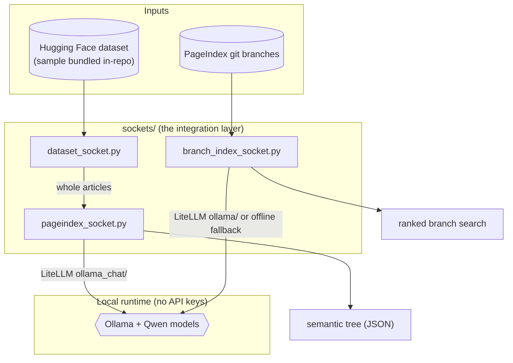
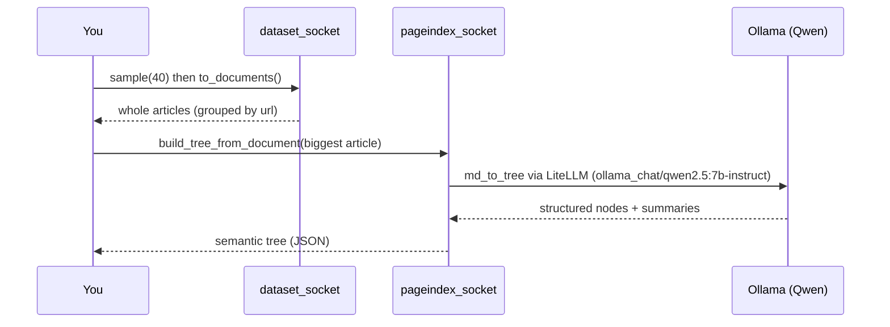
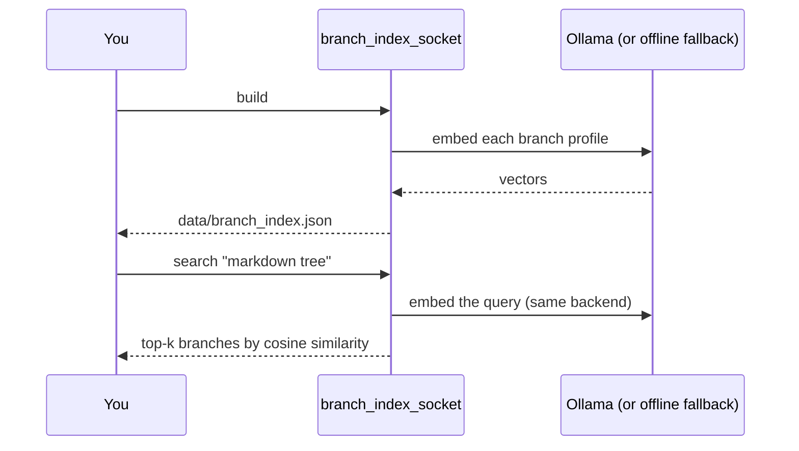

# Architecture — how RagIndex is built

This document walks through **every part of the project that exists today** and
explains *what it does* and *why it is built that way*.

---

## 1. The big idea: "sockets"

The project joins two independent things:

1. A **dataset** — 1.2M Wikipedia *science* text chunks on Hugging Face.
2. A **model** — [PageIndex](https://github.com/VectifyAI/PageIndex), a
   *vectorless, reasoning-based RAG* engine that turns a document into a
   hierarchical "table-of-contents" tree an LLM can reason over (no vector DB,
   no manual chunking).

Rather than wiring these together with tangled code, each integration lives
behind a thin adapter we call a **socket**. Like a wall socket lets you plug in
any appliance without rewiring the house, each module in `sockets/` exposes a
simple interface and hides the messy details of `datasets`, `litellm`, or `git`.



---

## 2. Repository map

```
RagIndex/
├── RagIndex.code-workspace   # open THIS in VS Code (multi-root workspace)
├── config.py                 # ONE control panel for every setting
├── sockets/                  # the integration layer
│   ├── dataset_socket.py     #   - dataset doorway (local-first, streaming fallback)
│   ├── pageindex_socket.py   #   - PageIndex model adapter (Ollama-backed)
│   └── branch_index_socket.py#   - semantic git-branch search (Ollama or offline)
├── scripts/
│   ├── setup.sh              # one-command reproducible setup
│   ├── make_dataset_sample.py#   (re)build the bundled dataset sample
│   ├── index_branches.py     #   CLI: list / build / search branches
│   └── try_pipeline.py       #   dataset -> PageIndex end-to-end demo
├── dataset/                  # consolidated dataset SAMPLE (parquet, committed in-repo)
│   └── wikipedia_science_chunked_sample.parquet   # 30k rows, ~13 MB
├── ollama-models.txt         # exact local Qwen model tags everyone pulls
├── requirements.txt          # Python deps (pinned to match PageIndex)
├── .env.example              # optional local overrides (NO API keys)
├── .gitignore                # keeps vendor/, data/, .env, .venv out of git
├── docs/                     # you are here
├── data/                     # generated caches (git-ignored, rebuilt locally)
└── vendor/PageIndex/         # the model, cloned by setup.sh (git-ignored, NOT committed)
```

> **Two folders are intentionally NOT committed:** `vendor/` (the PageIndex
> "mother" repo, re-cloned by `setup.sh`) and `data/` (generated caches like the
> branch index). This keeps our repo small and reproducible.

---

## 3. The control panel — [config.py](../config.py)

Every other file imports its settings from here, so you only change things once.
It is deliberately **dependency-light**: importing it works even before you
`pip install` anything (the branch indexer relies on that).

Key things it defines:

| Setting | Meaning |
| --- | --- |
| `ROOT`, `VENDOR_DIR`, `PAGEINDEX_DIR`, `DATA_DIR` | All project paths in one place. |
| `DATASET_ID` + column names | The Hugging Face dataset and its `text` / `title` / `category` / `url` columns. |
| `LOCAL_DATASET_PATH`, `USE_LOCAL_DATASET`, `DATASET_SAMPLE_ROWS` | The bundled local sample, the toggle to prefer it, and how many rows to sample (default **30,000**). |
| `OLLAMA_HOST` | Where the local Ollama server listens (`http://localhost:11434`). Also exported as `OLLAMA_API_BASE` for LiteLLM. |
| `OLLAMA_CHAT_TAG` / `OLLAMA_EMBED_TAG` | The bare model tags `ollama pull` downloads. |
| `LLM_MODEL` (`ollama_chat/...`) / `EMBED_MODEL` (`ollama/...`) | Fully-qualified names LiteLLM routes to the **local** server. |

Anything here can be overridden with environment variables (or a local `.env`),
so no code edits are needed to retarget a model or the dataset.

---

## 4. The sockets (the integration layer)

### 4.1 Dataset socket — [sockets/dataset_socket.py](../sockets/dataset_socket.py)

The single doorway through which Wikipedia-science data enters the workspace.

- **Local-first:** if `dataset/wikipedia_science_chunked_sample.parquet` exists
  (and `USE_LOCAL_DATASET` is on), it reads that parquet directly via PyArrow —
  **no network**. Otherwise it **streams** the full dataset from Hugging Face on
  demand (almost no disk).
- `iter_chunks(limit, category)` — yields clean `{text, title, category, url}`
  dicts (also strips stray leading spaces from titles).
- `to_documents(chunks)` — regroups consecutive chunks that share a `url` back
  into one whole article (PageIndex needs a full document, not chunks).
- `to_markdown(doc)` — renders a grouped article as Markdown — exactly the shape
  the PageIndex socket expects. This is what makes the two sockets "click".

### 4.2 Model socket — [sockets/pageindex_socket.py](../sockets/pageindex_socket.py)

Plugs the **vendored** PageIndex project into the workspace and hides two awkward
details:

1. PageIndex is a *cloned repo*, not a pip package → `ensure_importable()` adds
   `vendor/PageIndex` to `sys.path`.
2. Its markdown entry point `md_to_tree` is **async** and wants a *file path* →
   we wrap it in a simple, synchronous, text-in / tree-out function.

- `_require_ollama()` — health-checks the local Ollama server and confirms the
  chat model is pulled, failing early with a friendly message (no API key).
- `build_tree_from_markdown_text(...)` — the main entry: writes text to a temp
  `.md`, runs `md_to_tree(...)` via `asyncio.run`, returns the tree as a nested
  dict, and cleans up.
- `build_tree_from_document(doc)` — the convenience bridge from a dataset-socket
  document straight to a tree.

Every document format (PDF, DOCX, HTML, Markdown, TXT) is converted to plain text
*before* this socket — by the upload / ingest sockets — and then indexed through
the single `build_tree_from_markdown_text(...)` path, so indexing cost depends on a
document's length, not its format.

PageIndex reaches the model through **LiteLLM** using the `ollama_chat/<tag>`
provider, so calls go to your **local** Ollama server.

### 4.3 Branch-index socket — [sockets/branch_index_socket.py](../sockets/branch_index_socket.py)

Lets you ask *"which branch deals with markdown trees?"* and get the right
PageIndex branch back. It uses **only the Python standard library + git**, so it
runs immediately after cloning — no `pip install` required.

Four steps:

1. **List** every `origin/*` branch.
2. **Profile** each branch from cheap git signals: branch name, latest commit,
   files changed vs `main`, and the top of its README.
3. **Embed** each profile into a vector. It **auto-detects**: if the local Ollama
   server is up it uses **real semantic embeddings** (`qwen3-embedding:0.6b`);
   otherwise it falls back to a **dependency-free offline** "hashing trick"
   embedding that matches spelling/wording.
4. **Search** by embedding your query the same way and ranking by cosine
   similarity.

> Important detail: the offline embedder uses a **stable md5 hash**, not Python's
> built-in `hash()` (which is randomized per process and would make a saved index
> unsearchable later).

---

## 5. The scripts

| Script | What it does |
| --- | --- |
| [scripts/setup.sh](../scripts/setup.sh) | One command, idempotent: makes `.venv`, installs deps, clones PageIndex + fetches all branches, installs Ollama, starts the server, and pulls the pinned Qwen models. |
| [scripts/make_dataset_sample.py](../scripts/make_dataset_sample.py) | Streams `DATASET_SAMPLE_ROWS` rows from Hugging Face and writes ONE zstd-compressed parquet to `dataset/`. Re-run to regenerate/resize. |
| [scripts/index_branches.py](../scripts/index_branches.py) | CLI for the branch socket: `list`, `build` (add `--llm` to force Ollama embeddings), and `search "query"`. |
| [scripts/try_pipeline.py](../scripts/try_pipeline.py) | End-to-end demo: pull chunks → rebuild the biggest article → print its PageIndex tree. |

---

## 6. Local runtime — Ollama + Qwen (no API keys)

Everything is served by a local **[Ollama](https://ollama.com)** runtime, pinned
in [ollama-models.txt](../ollama-models.txt):

| Role | Model | Used by | Why |
| --- | --- | --- | --- |
| Chat / reasoning | `qwen2.5:7b-instruct` | PageIndex tree building | Strong instruction-following + **clean JSON** (we avoid "thinking" models whose extra tags break PageIndex's JSON parsing). |
| Embeddings | `qwen3-embedding:0.6b` | branch semantic search | Small, fast, retrieval-tuned. |

Both reach the server through **LiteLLM** (`ollama_chat/...` for chat,
`ollama/...` for embeddings), pointed at `OLLAMA_HOST`. No request ever leaves
the machine. There are **no API keys anywhere** — `.env` is only for optional
overrides.

---

## 7. How the data flows at run time

**Pipeline demo (`try_pipeline.py`):**



**Branch search (`index_branches.py`):**



---

## 8. Reproducibility model (why teammates don't copy big folders)

- **The model** (`vendor/PageIndex`) is git-ignored and **re-cloned** by
  `setup.sh`, so our repo stays small and is not entangled with upstream history.
- **The models** (Qwen) are **re-pulled** by `setup.sh` from `ollama-models.txt`.
- **The data** is a small in-repo sample, so a fresh clone runs **offline** out of
  the box, and `make_dataset_sample.py` can rebuild/resize it deterministically.
- **Generated caches** (`data/`, including `branch_index.json`) are git-ignored
  and rebuilt locally.

Result: `git clone <repo> && cd RagIndex && bash scripts/setup.sh` reproduces the
exact same local environment on any machine — no keys, no cloud.

---

## 9. Git / publishing state

- **Remote:** `origin` → `https://github.com/1ssb/TuringTree.git`
- **Release:** published on `main` under the **MIT License** (see
  [LICENSE](../LICENSE)); tagged versions are on the
  [Releases page](https://github.com/1ssb/TuringTree/releases).
- **Reproducible from scratch:** `vendor/` and `data/` are git-ignored and rebuilt
  by `setup.sh`, so the repo stays small and every checkout reproduces the same env.
