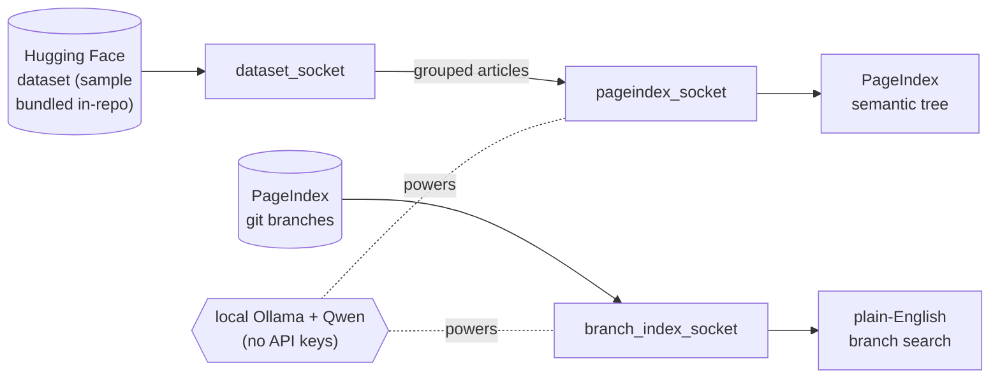

# RagIndex — Documentation

Welcome! This `docs/` folder is the **single place that explains the whole
project in plain English**: what it is, how every piece works, and the design
choices behind it.

It is written for someone who is **new to the project** — you should be able to
read these top-to-bottom and understand the entire thing without digging through
code first.

---

## Start here

| If you want to… | Read this |
| --- | --- |
| Understand **how the project is built** (every file, the data flow, design choices) | [ARCHITECTURE.md](ARCHITECTURE.md) |
| See the **confidence scoring** in depth | [confidence_scoring.md](confidence_scoring.md) |
| Read the **benchmark** method & results | [benchmark.md](benchmark.md) |
| Build the **desktop app** | [desktop.md](desktop.md) |
| Just **run it** (setup + commands) | the top-level [../README.md](../README.md) |

---

## The project in one paragraph

**RagIndex** is a small, friendly workspace that plugs together **two pieces** —
a Hugging Face *Wikipedia-science* **dataset** and the **PageIndex** "vectorless"
RAG **model** — through thin adapters we call **sockets**. It also ships a tool
that **semantically searches the PageIndex repo's git branches** in plain
English. Everything runs **fully on your machine** through a local **Ollama**
runtime with **Qwen** models: no API keys, no cloud, no network at run time.

---

## Where to go next

- **Run it:** the top-level [../README.md](../README.md).
- **Understand it:** [ARCHITECTURE.md](ARCHITECTURE.md).
- **The confidence layer:** [confidence_scoring.md](confidence_scoring.md).
- **Benchmarks & method:** [benchmark.md](benchmark.md).
