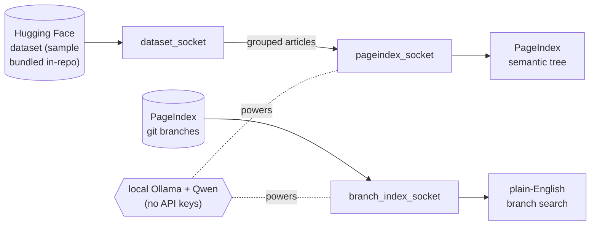

# RagIndex — Documentation

Welcome! This `docs/` folder is the **single place that explains the whole
project in plain English**: what it is, what has already been built, how every
piece works, and what is still left to do.

It is written for someone who is **new to the project** — you should be able to
read these top-to-bottom and understand the entire thing without digging through
code first.

> Last updated: **2026-06-23** · Branch: **`ui-ux`** · Latest commit: **`7206e11`**

---

## Start here

| If you want to… | Read this |
| --- | --- |
| Understand **what is finished** and **what is still pending** | [PROJECT_STATUS.md](PROJECT_STATUS.md) |
| Understand **how the project is built** (every file, the data flow, design choices) | [ARCHITECTURE.md](ARCHITECTURE.md) |
| Just **run it** (setup + commands) | the top-level [../README.md](../README.md) |

---

## The project in one paragraph

**RagIndex** is a small, friendly workspace that plugs together **two pieces** —
a Hugging Face *Wikipedia-science* **dataset** and the **PageIndex** "vectorless"
RAG **model** — through thin adapters we call **sockets**. It also ships a tool
that **semantically searches the PageIndex repo's git branches** in plain
English. Everything runs **fully on your machine** through a local **Ollama**
runtime with **Qwen** models: no API keys, no cloud, no network at run time.

---

## Status at a glance

- ✅ **Core workspace built** — config, 3 sockets, 4 scripts, reproducible setup.
- ✅ **Fully local** — migrated from cloud OpenAI to onboard Ollama + Qwen (no keys).
- ✅ **Dataset consolidated** — a 30k-row (~13 MB) sample committed in-repo; runs offline.
- ✅ **Published** — pushed to GitHub (`origin/main`).
- 🔜 **UI/UX** — this `ui-ux` branch is where a user interface will be added. **None exists yet.**
- 🔜 **Tests, pinned model version, full dataset** — see [PROJECT_STATUS.md](PROJECT_STATUS.md).

See [PROJECT_STATUS.md](PROJECT_STATUS.md) for the complete, detailed list.
